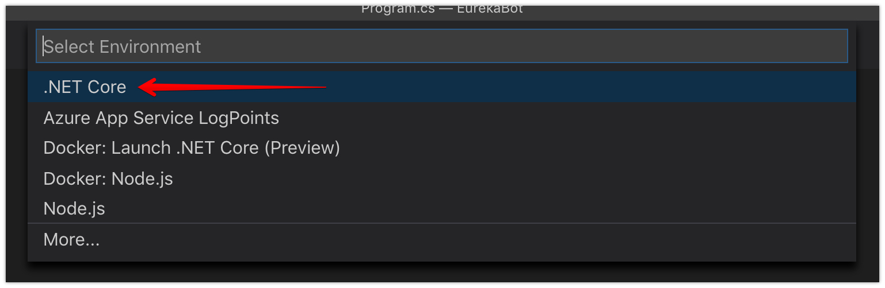
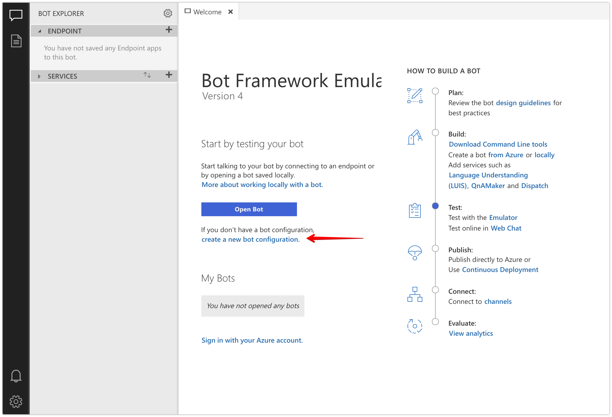
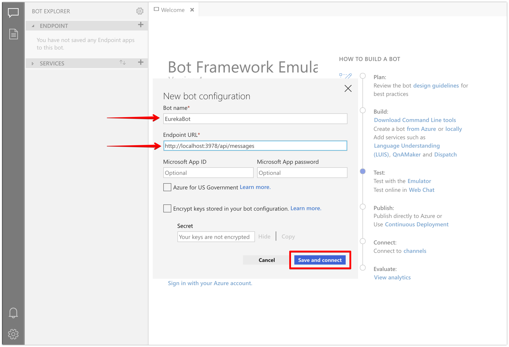
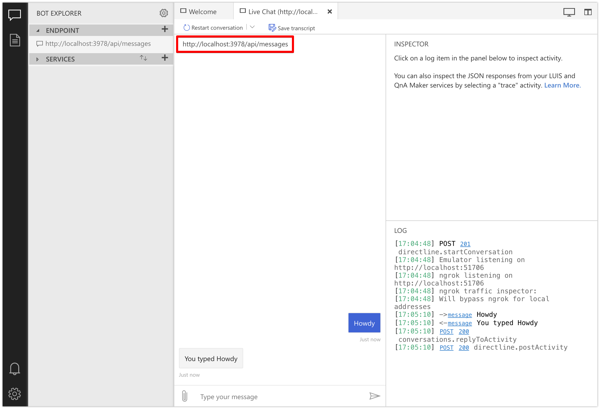
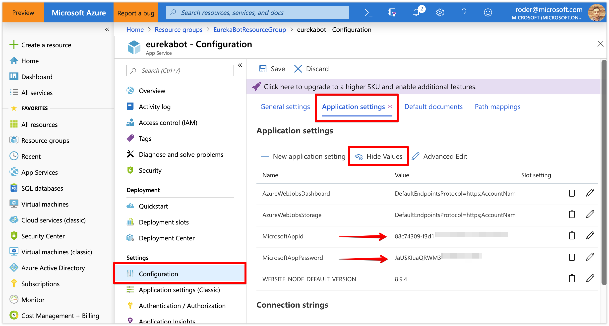
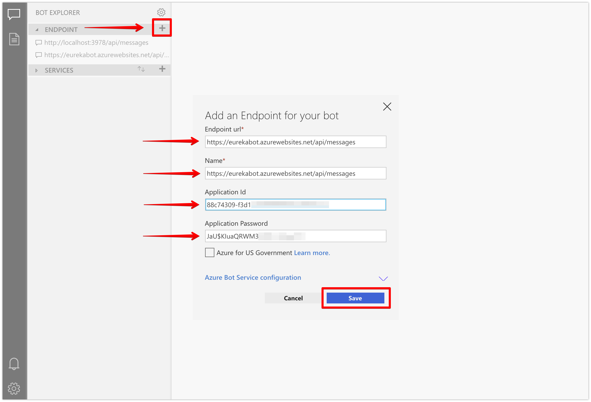

# Azure Bot Framework - Debugging and Deploying Your Bot to Azure using CI/CD

### This guide will help you get local debugging working so you can step through code. Then we'll deploy your bot using CI/CD against your code repository. 

When you've completed this tutorial, you should expect to see this:
<br/><br/><br/>

### Section 1: Download the Generated Boilerplate Code

<!--1. Browse to [https://portal.azure.com](https://portal.azure.com) and log in-->

1. Clone [this repository](https://github.com/rob-derosa/EurekaBot)
   ```
   git clone https://github.com/rob-derosa/EurekaBot.git
   ```

1. In VS Code or Visual Studio 2017, open the project located at `src/start_here/EurekaBot` - this will be our baseline for our QnA bot

1. Open the `Bot.cs` file and check out the code, specifically the `OnTurnAsync` method and the `TurnContext` object - this is where your bot gets the opportunity to determine the `ActivityType` and act accordingly (i.e. `Message`, `ConversationUpdate`, `EndConversation`, `Typing`, etc)
	- this bot is considered a "single-turn" bot because it processes a single request and responds with an answer, like asking for the weather
	- for "multi-turn" bots, check out [Waterfall Dialogs](https://docs.microsoft.com/en-us/azure/bot-service/bot-builder-dialog-manage-conversation-flow?view=azure-bot-service-4.0) that are specifically designed to handle multiple round trips to the user to gather the info necessary to complete the task at hand - this could be ordering a pizza, scheduling a Lyft ride, etc

1. Build the project
	- if in VS Code, open the terminal (__Terminal > New Terminal__) and type `dotnet build` and ensure there are no build errors
	- if in Visual Studio 2017, right click on the project and select __Build__

1. Hit `F5` to start debugging the bot endpoint locally and look for the `localhost` endpoint in the console output - it should be something similar to `http://localhost:3897`
	- if in VS Code, you will need to allow VS Code to create a build configuration the first time - go ahead and select __.NET Core__, then hit `F5` again
	<br/>

1. Open the Bot Framework Emulator and click the __create new bot configuration__ button
<br/>

1. Enter __EurekaBot__ for the Bot name (this can be anything)

1. Enter the local debugging endpoint URL of `http://localhost:3978/api/messages` and click the __Save and connect__ button
<br/>

1. Type a message and hit enter - the bot should echo the message right back to you
<br/>

<br/>

### Section 2: Configure CI/CD to Deploy on Commit

1. In the online repository option of your choice (GitHub, Azure Repos, etc), create a new repository to host the source code for this project

1. Commit and push the project source code of root of this project to the `master` branch

1. Browse to [https://portal.azure.com](https://portal.azure.com) and log in

1. Navigate to the Resource Group that contains your bot services

1. Click on the App Service tied to your bot

1. Click on the __Deployment Center__ section

1. Choose the Source Control Provider (i.e. Github) where your code is checked in and click __Continue__

1. Choose __App Service Kudu build server__ as the Build Provider and click __Continue__
<br/>

1. Sign into your repository host if necessary

1. Complete any settings specific to the source control provider selected in the previous step such as the organization, repository name and branch to watch and click __Continue__
<br/>

1. If all the settings look good, click the __Finish__ button - this will create the connection to the repo and automatically build and deploy your project whenever you push a commit to your master branch

1. Confirm the build was successful 
<br/>

1. Test that your bot is working properly by navigating to your Web App Bot and select the __Test in web chat__ section
<br/>
If everything worked, you should see the same behavior as you did locally - the bot should echo back the message you typed

1. We can also test using the Bot Framework Emulator by creating a new endpoint pointing to our bot service hosted in Azure
	1. Click the __+__ button in the __ENDPOINT__ section on the left
	1. For the __Endpoint url__ and the __Name__, enter the bot's remote endpoint - i.e. `https://YOURBOTENDPOINT.azurewebsites.net/api/messages`
	1. Now that we're going to hit the hosted/remote endpoint, we need to authorize the emulator so let's navigate to the __Configuration__ section of the app service tied to your bot in the Azure Portal
	1. Click on the __Application settings__ section
	1. Click on the __Show Values__ button to expose the application setting values
	1. Copy the `MicrosoftAppId` and `MicrosoftAppPassword` values and paste them into the new remote endpoint settings and click the __Save__ button
		<br/>
		<br/>
	1. Initiate a chat conversation and validate the response

Congrats! You are now free to make changes, commit and push them and your changes will automatically be deployed to your remote instance
